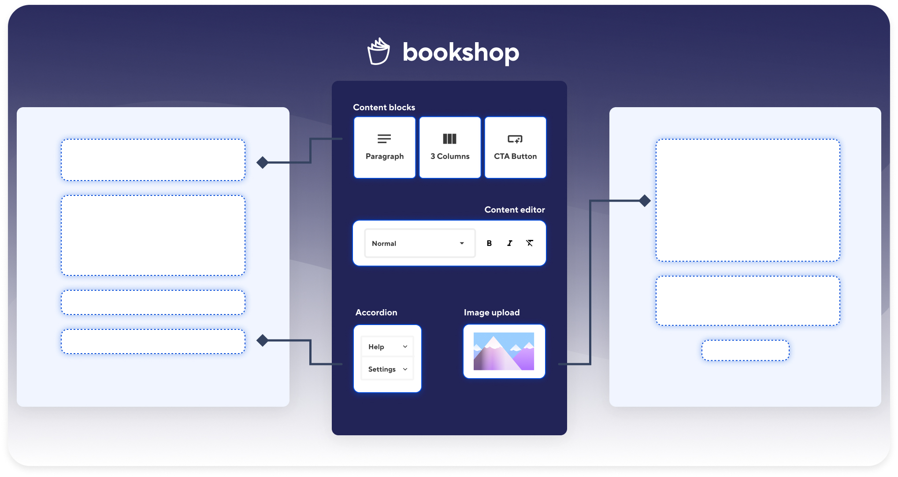

= Bookshop
ifdef::env-github[]
:tip-caption: :bulb:
:note-caption: :information_source:
:important-caption: :heavy_exclamation_mark:
:caution-caption: :fire:
:warning-caption: :warning:
endif::[]

https://github.com/CloudCannon/bookshop/actions/workflows/integration-test.yml[image:https://github.com/CloudCannon/bookshop/actions/workflows/integration-test.yml/badge.svg?branch=main&event=push[Integration Test Status]]
https://github.com/CloudCannon/bookshop/actions/workflows/test-node.yml[image:https://github.com/CloudCannon/bookshop/actions/workflows/test-node.yml/badge.svg?branch=main&event=push[Javascript Test Status]]
https://github.com/CloudCannon/bookshop/actions/workflows/test-ruby.yml[image:https://github.com/CloudCannon/bookshop/actions/workflows/test-ruby.yml/badge.svg?branch=main&event=push[Ruby Test Status]]

[.lead]
Bookshop is a component development workflow for static websites. Bookshop currently supports Jekyll and Eleventy, with Hugo support coming in the near future.

== Concepts

Bookshop defines a convention for building self-contained components in the templating languages supported by common static site generators. Using these conventions, Bookshop provides developer tooling that empowers you to integrate these components with your stack, build and browse UI components locally, and provide rich live editing experiences for your editors.

== Guides

For learning Bookshop conventions, see the link:guides/conventions.adoc[Conventions Guide]

For integrating a Bookshop with Jekyll, see the link:guides/jekyll.adoc[Jekyll Guide]

For integrating a Bookshop with Eleventy, see the link:guides/eleventy.adoc[Eleventy Guide]

For setting up the Bookshop component browser, see the link:guides/browser.adoc[Browser Guide]

For information on live editing, see the link:guides/live-editing.adoc[Live Editing Guide]
