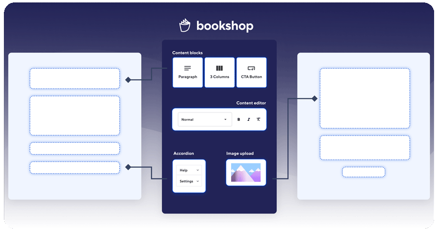

= Bookshop
ifdef::env-github[]
:tip-caption: :bulb:
:note-caption: :information_source:
:important-caption: :heavy_exclamation_mark:
:caution-caption: :fire:
:warning-caption: :warning:
endif::[]
:version: 3.18.0-alpha.1

https://github.com/CloudCannon/bookshop/actions/workflows/integration-test.yml[image:https://github.com/CloudCannon/bookshop/actions/workflows/integration-test.yml/badge.svg?branch=main&event=push[Integration Test Status]]
https://github.com/CloudCannon/bookshop/actions/workflows/test-node.yml[image:https://github.com/CloudCannon/bookshop/actions/workflows/test-node.yml/badge.svg?branch=main&event=push[Javascript Test Status]]
https://github.com/CloudCannon/bookshop/actions/workflows/test-ruby.yml[image:https://github.com/CloudCannon/bookshop/actions/workflows/test-ruby.yml/badge.svg?branch=main&event=push[Ruby Test Status]]

https://github.com/cloudcannon/bookshop/releases/[image:https://img.shields.io/static/v1?label=version&message={version}&style=flat&color=informational[Version {version}]]
image:https://img.shields.io/github/release-date/cloudcannon/bookshop?color=informational[GitHub Release Date]

[.lead]
Bookshop is a component development workflow for static websites. Bookshop currently supports Astro, Jekyll, Eleventy, Hugo, and SvelteKit, with support for more SSGs coming in the near future.

== Concepts

Bookshop defines a convention for building self-contained components in the templating languages supported by common static site generators. Using these conventions, Bookshop provides developer tooling that empowers you to integrate these components with your stack, build and browse UI components locally, and provide rich live editing experiences for your editors.

A good rundown of our motivations and the problems we are looking to solve can be found in our link:https://cloudcannon.com/blog/introducing-bookshop/[launch post on CloudCannon].

== Quick start
To get started, head over to the guide for the SSG you would like to work with.

* link:guides/hugo.adoc[Hugo Bookshop Reference Guide]

* link:https://cloudcannon.com/documentation/guides/bookshop-eleventy-guide/[Eleventy Bookshop Guide]

* link:https://cloudcannon.com/documentation/guides/bookshop-astro-guide/[Astro Bookshop Guide]

* link:guides/jekyll.adoc[Jekyll Bookshop Reference Guide]

* link:guides/sveltekit.adoc[SvelteKit Bookshop Reference Guide]
